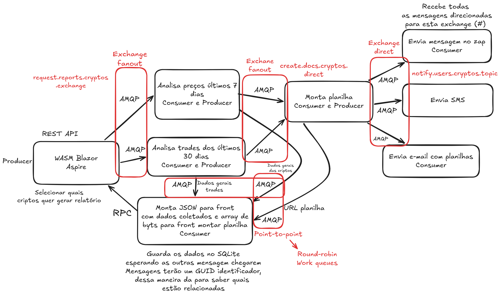

# Projeto over-engineering

Projeto para reforçar alguns fundamentos do RabbitMQ que utilizo no dia a dia do trabalho.
Fiz um projeto com bastante over-engineering para revisitar conceitos de mensageria, principalmente a criacao de fluxos com exchanges de tipos diferentes, como `fanout`, `topic` e `direct`.

O projeto principal esta na pasta **MonitorandoCriptosOverEngineering**.

## Linha de pensamento da arquitetura

Antes de implementar, pensei no fluxo como uma cadeia de produtores e consumidores que:

- recebe a solicitacao do front-end;
- distribui analises de precos e trades em paralelo;
- consolida os resultados em uma planilha;
    - Armazena as mensagens recebidas no SQLite, assim quando tiver todas as mensagens necessárias para montar o JSON de resposta para o front ele publica a mensagem que utiliza o protocolo RPC para aguardar a resposta do front
- publica notificacoes e respostas para outros consumidores.
- Utiliza RPC para encaminhar o JSON com os dados das criptos selecionadas, esperando receber devolta uma mensagem escrita pelo usuário (por isso a utilização de RPC (over engineering))

Uitlizado **Aspire** para conhecimento da ferramenta.

A imagem abaixo representa essa linha de raciocinio e o excesso de camadas que guiaram a montagem do projeto:

